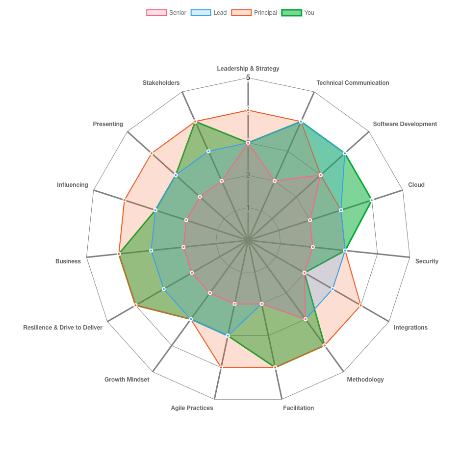

# Skills Radar

<https://madetech.github.io/skills-radar>

## Technical Architect Roles

This project generates a skills radar based on the Technical Architect skill
sets that we think are important.



## Custom Roles

You can upload files with custom attributes, skill levels and role levels.

Create a JSON file with this file structure and upload it:

```JSON
{
  "title": "Test Attributes",
  "RoleData": {
    "Attribute 1": {
      "Skill level 1": null,
      "Skill level 2": null,
      "Skill level 3": null,
      "Skill level 4": null
    },
    "Attribute 2": {
      "Skill level 1": null,
      "Skill level 2": null,
      "Skill level 3": null,
      "Skill level 4": null
    },
    "Attribute 3": {
      "Skill level 1": null,
      "Skill level 2": null,
      "Skill level 3": null,
      "Skill level 4": null
    },
    "Attribute 4": {
      "Skill level 1": null,
      "Skill level 2": null,
      "Skill level 3": null,
      "Skill level 4": null
    },
    "Attribute 5": {
      "Skill level 1": null,
      "Skill level 2": null,
      "Skill level 3": null,
      "Skill level 4": null
    }
  },
  "RoleLevels": {
    "Test": {
      "data": [4, 3, 4, 1, 3],
      "backgroundColor": "rgba(54, 162, 235, 0.2)",
      "color": "rgb(54, 162, 235)"
    }
  }
}
```

- You can have as many attributes as you want.
- You have to keep the skill level consistent, i.e. always 4 or 5 etc.
- You have as many Role Levels as you want, "You" will always be last.
- The Role Levels `data` field is expressed as an index from 1 to however many skill levels you have.
  - E.g. Level 1 = 1, Level 2 = 2

# Development

## Available Scripts

In the project directory, you can run:

### `npm start`

Runs the app in the development mode.\
Open [http://localhost:3000](http://localhost:3000) to view it in your browser.

The page will reload when you make changes.\
You may also see any lint errors in the terminal.

### `npm test`

Launches the test runner in the interactive watch mode.\
See the section about [running tests](https://facebook.github.io/create-react-app/docs/running-tests) for more information.

### `npm run build`

Builds the app for production to the `build` folder.\
It correctly bundles React in production mode and optimizes the build for the best performance.

The build is minified and the filenames include the hashes.\
Your app is ready to be deployed!

See the section about [deployment](https://facebook.github.io/create-react-app/docs/deployment) for more information.

### `npm run deploy`

Deploys the app to GitHub Pages. You should not need to use this as a GitHub Action is setup to achieve this.
